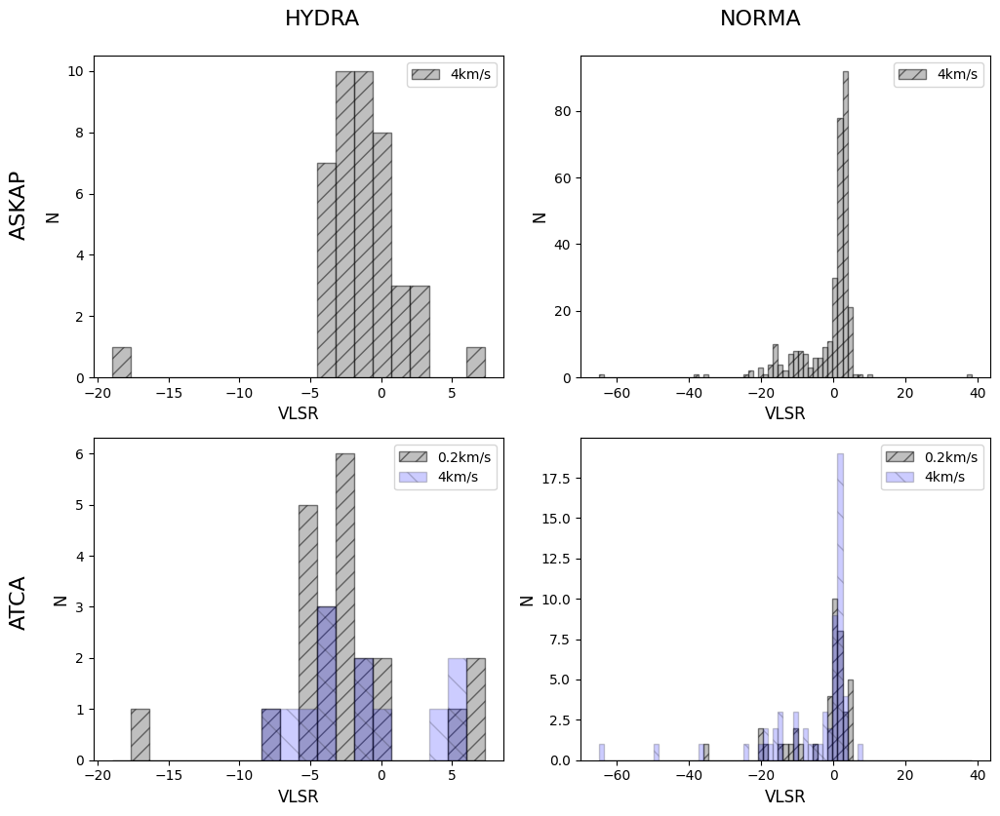

## Data Overview
In this investigation, we used Gausspy+ to decompose HI spectra from the Norma and Hydra fields, drawing data from both the ATCA and ASKAP telescopes. The primary focus was to analyze the spectra by leveraging data sets at different resolutions and contrasting the performance of the decomposition based on signal quality and noise levels.
### Data Sources and Resolutions ###
•	ATCA Data: Two resolution sets were used—4 km/s and 0.2 km/s—across both fields.

•	ASKAP Data: Only the 4 km/s resolution was available.
### ATCA Data Cube Dimensions:
1.	Norma Field:
o	0.2 km/s, Cube 1: (1500, 6, 3)
o	0.2 km/s, Cube 2: (1000, 3, 3)
o	4 km/s, Cube: (140, 7, 6)
o	Resolutions: 0.2061 km/s and 3.916 km/s, with starting points of -146.511 km/s for the 1500 array, -119.419 km/s for the 1000 array, and -189.337 km/s for the 4 km/s cube.
2.	Hydra Field:
o	0.2 km/s, Cube 1: (1500, 5, 3)
o	0.2 km/s, Cube 2: (1000, 4, 3)
o	4 km/s, Cube: (140, 5, 6)
o	Starting points: -140.664 km/s for the 1500 array, -112.929 km/s for the 1000 array, and -185.687 km/s for the 4 km/s cube.
### ASKAP Data Cube Dimensions:
1.	Norma Field: (270, 17, 18)
2.	Hydra Field: (270, 6, 9)
o	Resolution: 3.909 km/s, with starting points at -446.172 km/s for Hydra and -437.312 km/s for Norma.
### Signal Quality Assessment
•	ASKAP Data: Provided significantly better signal quality, especially in the Norma field. The high signal-to-noise ratio (SNR) made decomposition straightforward, with minimal interference from noise.

•	ATCA Data:
-	Norma Field: Data at 4 km/s had a decent signal-to-noise ratio, so no smoothing was applied. However, the 0.2 km/s data required a Gaussian kernel (σ = 1) to handle noise.

-	Hydra Field: ATCA data here suffered from poor SNR, especially in the 0.2 km/s dataset, with many channels showing spikes indistinguishable from noise, making reliable decomposition challenging.
### Decomposition Strategy and Parameters
Norma Field:
1.	ATCA 4 km/s:
o	Parameters: Minimum channels = 40, SNR = 4
o	Alpha values for decomposition: α₁ = 2.25, α₂ = 5.97
o	Result: Successful decomposition with well-separated components.
2.	ATCA 0.2 km/s:
o	Two datasets (1500 and 1000 channels) were smoothed using a Gaussian kernel to handle noise.
o	For 1500 channels:
-	SNR = 7, significance = 7
-	Min_FWHM = 5, Max_FWHM = 100
-	Result: Decomposition yielded reasonable results, although some broad components were problematic.
o	For 1000 channels:
-	The same SNR and significance values were applied, but fitting issues persisted due to noise spikes.

Hydra Field:
1.	ATCA 4 km/s:
o	Default parameters provided good results, although the low SNR of some sources limited decomposition accuracy.
2.	ATCA 0.2 km/s:
o	SNR = 3.5 and significance = 7, with data smoothed using a Gaussian kernel (σ = 1).
o	Result: Satisfactory decomposition for most sources, though a few were too noisy to fit properly.

ASKAP Data:
-	Both Hydra and Norma fields showed excellent decomposition results due to higher SNR.
-	Parameters: SNR = 4

## Results
### Histrograms
|  |  |
|:-------------------------------------------:|:-------------------------------------------:|

|  |  |
|:-------------------------------------------:|:-------------------------------------------:|

### Hydra Field
|  |  |
|:-------------------------------------------:|:-------------------------------------------:|

|  |  |
|:-------------------------------------------:|:-------------------------------------------:|

|  |  |
|:-------------------------------------------:|:-------------------------------------------:|

|  |  |
|:-------------------------------------------:|:-------------------------------------------:|

### Norma Field

|  |  |
|:-------------------------------------------:|:-------------------------------------------:|

|  |  |
|:-------------------------------------------:|:-------------------------------------------:|

|  |  |
|:-------------------------------------------:|:-------------------------------------------:|

|  |  |
|:-------------------------------------------:|:-------------------------------------------:|

