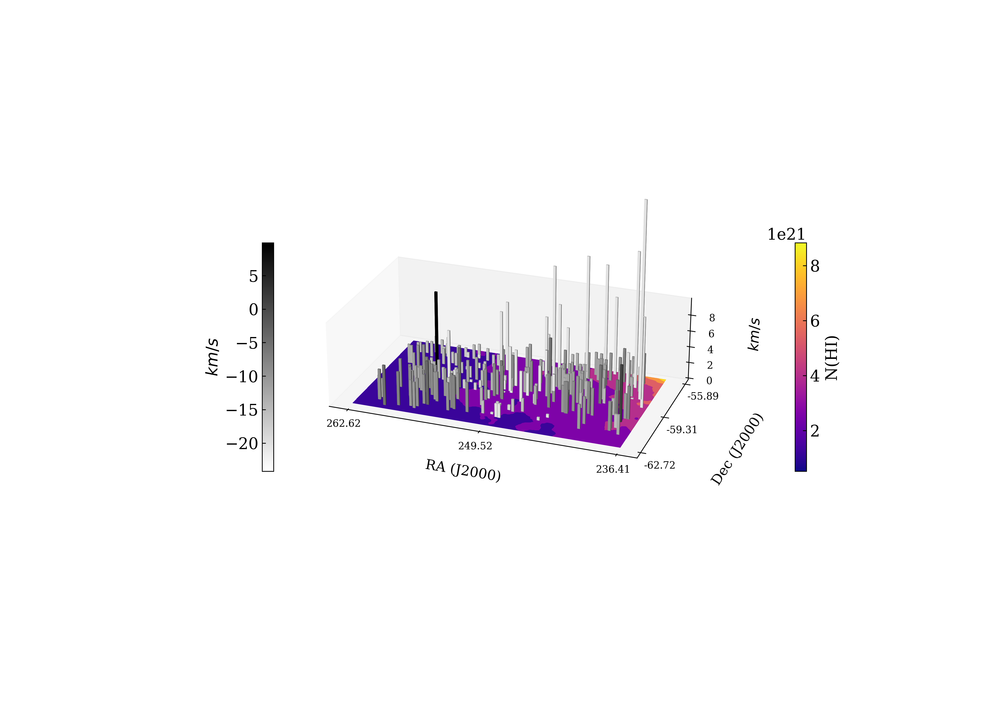

# Data Overview
In this investigation, we used Gausspy+ to decompose HI spectra from the Norma and Hydra fields, drawing data from both the ATCA and ASKAP telescopes. The primary focus was to analyze the spectra by leveraging data sets at different resolutions and contrasting the performance of the decomposition based on signal quality and noise levels.
### Data Sources and Resolutions ###
•	ATCA Data: Two resolution sets were used—4 km/s and 0.2 km/s—across both fields.

•	ASKAP Data: Only the 4 km/s resolution was available.
### ATCA Data Cube Dimensions:
1.	Norma Field:
o	0.2 km/s, Cube 1: (1500, 6, 3)
o	0.2 km/s, Cube 2: (1000, 3, 3)
o	4 km/s, Cube: (140, 7, 6)
o	Resolutions: 0.2061 km/s and 3.916 km/s, with starting points of -146.511 km/s for the 1500 array, -119.419 km/s for the 1000 array, and -189.337 km/s for the 4 km/s cube.
2.	Hydra Field:
o	0.2 km/s, Cube 1: (1500, 5, 3)
o	0.2 km/s, Cube 2: (1000, 4, 3)
o	4 km/s, Cube: (140, 5, 6)
o	Starting points: -140.664 km/s for the 1500 array, -112.929 km/s for the 1000 array, and -185.687 km/s for the 4 km/s cube.
### ASKAP Data Cube Dimensions:
1.	Norma Field: (270, 17, 18)
2.	Hydra Field: (270, 6, 9)
o	Resolution: 3.909 km/s, with starting points at -446.172 km/s for Hydra and -437.312 km/s for Norma.
### Signal Quality Assessment
•	ASKAP Data: Provided significantly better signal quality, especially in the Norma field. The high signal-to-noise ratio (SNR) made decomposition straightforward, with minimal interference from noise.

•	ATCA Data:
-	Norma Field: Data at 4 km/s had a decent signal-to-noise ratio, so no smoothing was applied. However, the 0.2 km/s data required a Gaussian kernel (σ = 1) to handle noise.

-	Hydra Field: ATCA data here suffered from poor SNR, especially in the 0.2 km/s dataset, with many channels showing spikes indistinguishable from noise, making reliable decomposition challenging.
### Decomposition Strategy and Parameters
Norma Field:
1.	ATCA 4 km/s:
o	Parameters: Minimum channels = 40, SNR = 4
o	Alpha values for decomposition: α₁ = 2.25, α₂ = 5.97
o	Result: Successful decomposition with well-separated components.
2.	ATCA 0.2 km/s:
o	Two datasets (1500 and 1000 channels) were smoothed using a Gaussian kernel to handle noise.
o	For 1500 channels:
-	SNR = 7, significance = 7
-	Min_FWHM = 5, Max_FWHM = 100
-	Result: Decomposition yielded reasonable results, although some broad components were problematic.
o	For 1000 channels:
-	The same SNR and significance values were applied, but fitting issues persisted due to noise spikes.

Hydra Field:
1.	ATCA 4 km/s:
o	Default parameters provided good results, although the low SNR of some sources limited decomposition accuracy.
2.	ATCA 0.2 km/s:
o	SNR = 3.5 and significance = 7, with data smoothed using a Gaussian kernel (σ = 1).
o	Result: Satisfactory decomposition for most sources, though a few were too noisy to fit properly.

ASKAP Data:
-	Both Hydra and Norma fields showed excellent decomposition results due to higher SNR.
-	Parameters: SNR = 4

# Results
### Histrograms
**Hydra (ASKAP vs. ATCA):**
-	ASKAP (upper left) shows a relatively low range of amplitudes, mostly below 0.15, with a few outliers.
-	ATCA (lower left) at two resolutions (0.2 km/s and 4 km/s) shows a wider distribution. At 0.2 km/s, we see more detections across a broader amplitude range, with notable peaks at higher amplitudes (0.2). At 4km/s, most detections are concentrated at lower amplitudes around 0.05, with fewer signals at higher amplitudes.
-	The lower resolution (4 km/s) seems to smooth out the data, resulting in fewer but stronger detections, while the higher resolution (0.2 km/s) captures more details with a broader distribution.

**Norma (ASKAP vs. ATCA):**
-	In ASKAP (upper right), there is a high concentration of low-amplitude signals (around 0.5) with a long tail extending to larger values.
-	ATCA (lower right) also shows similar behavior with both resolutions. The 4 km/s resolution again smooths the distribution, with a few higher amplitude detections, while the 0.2 km/s resolution shows more sparse data. 
-	The Norma field shows a stronger concentration of low-amplitude detections in ASKAP, suggesting some commonality in low signal strength. The resolution in ATCA significantly affects the number of detections and their amplitude distribution.

|  |  |
|:-------------------------------------------:|:-------------------------------------------:|

**Hydra (ASKAP vs. ATCA):**
-	ASKAP (upper left) shows the majority of the velocities concentrated around 0 km/s, with one notable outlier at around -18 km/s.
-	ATCA (lower left) shows a similar trend, but at 0.2 km/s resolution, the VLSR distribution is more detailed, showing multiple peaks around -5 km/s and close to 0 km/s. and the outlier at around -18km/s
-	Hydra ASKAP and ATCA data exhibit similar velocity profiles suggesting ASKAP is capturing the bulk structure, but ATCA uncovers finer substructures in the velocity field.
**Norma (ASKAP vs. ATCA):**
-	ASKAP (upper right) reveals a very narrow VLSR distribution, with most of the data concentrated near 0 km/s but with a few extending up to large velocities (>200 km/s).
-	ATCA (lower right) shows a similar narrow peak around 0 km/s
-	The narrow velocity distribution in ASKAP for the Norma field could indicate the bulk of the HI gas in the Norma field has relatively little velocity variation. ATCA reveals additional fine structure but remains consistent with the ASKAP findings.

|  |  |
|:-------------------------------------------:|:-------------------------------------------:|

### Hydra Field

**(Top Left):** Amplitudes for Hydra at 4 km/s **(Top Right):** Amplitudes for Hydra at 0.2 km/s **(Bottom Left):** 3D Amplitudes for Hydra at 4 km/s **(Bottom Right):** 3D Amplitudes for Hydra at 0.2 km/s. Square for tau > 0.2  
|  |  |
|:-------------------------------------------:|:-------------------------------------------:|
|  |  |

**(Top Left):** VLSR for Hydra at 4 km/s **(Top Right):** VLSR for Hydra at 0.2 km/s **(Bottom Left):** 3D VLSR for Hydra at 4 km/s **(Bottom Right):** 3D VLSR for Hydra at 0.2 km/s. Square for abs(vlsr) > 15    
|  |  |
|:-------------------------------------------:|:-------------------------------------------:|
|  |  |

### Norma Field
**(Top Left):** Amplitudes for Norma at 4 km/s **(Top Right):** Amplitudes for Norma at 0.2 km/s **(Bottom Left):** 3D Amplitudes for Norma at 4 km/s **(Bottom Right):** 3D Amplitudes for Norma at 0.2 km/s. Square for tau > 1   
|  |  |
|:-------------------------------------------:|:-------------------------------------------:|
|  |  |

**(Top Left):** VLSR for Norma at 4 km/s **(Top Right):** VLSR for Norma at 0.2 km/s **(Bottom Left):** 3D VLSR for Norma at 4 km/s **(Bottom Right):** 3D VLSR for Norma at 0.2 km/s. Square for abs(vlsr) > 15      
|  |  |
|:-------------------------------------------:|:-------------------------------------------:|
|  |  |

### ASKAP
**(Top Left):** Amplitudes for Hydra ASKAP **(Top Right):** 3D Amplitudes for Hydra ASKAP **(Bottom Left):** 3D VLSR for Hydra ASKAP 
|  |  |
|:-------------------------------------------:|:-------------------------------------------:|
|  |  |

**(Top Left):** Amplitudes for Norma ASKAP **(Top Right):** 3D Amplitudes for Norma ASKAP **(Bottom Left):** 3D VLSR for Norma ASKAP  
|  |  |
|:-------------------------------------------:|:-------------------------------------------:|
|  |  |

